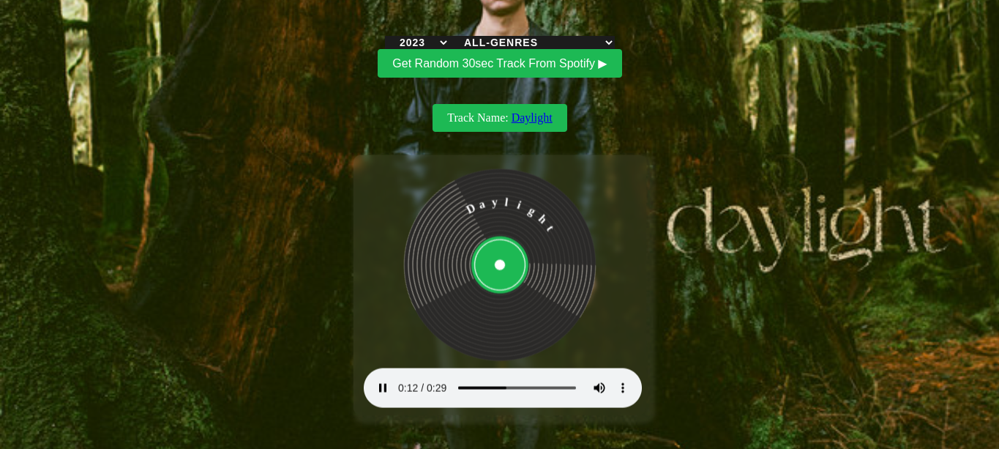

# Random Track From Spotify

This is a web application that uses the Spotify Web API to fetch and play a random track based on the user's input of a year and genre.

## Project Setup

This project uses the Spotify Web API to retrieve data. In order to use the API, you need to provide an authentication token. You can obtain a token by registering your app with Spotify and getting a Client ID and a Client Secret.

Once you have the Client ID and Client Secret, replace the CLIENT_ID and CLIENT_SECRET constants with your own values.

This project uses fetch() to make API requests. The getAuthToken() function retrieves an authentication token from Spotify's API, and the getRandomTrack() function retrieves a random track based on the user's selected year and genre.

## Features
* Fetches a random track from Spotify based on user input of a year and genre.
* Plays a preview of the track if available.
* Displays the track name with a link to the Spotify website.
* Sets the background image of the webpage to the album cover of the random track.

## How to Use

1. Select a year from the dropdown list.
2. Select a genre from the dropdown list.
3. Click the "Get Random 30sec Track From Spotify" button to generate a random track.

The track information will be displayed below the button, and the track preview will be played in the audio player. If a preview is not available for the selected track, an error message will be displayed.

## Technologies Used

* HTML
* CSS
* JavaScript
* Spotify Web API

## Setup

1. Clone the repository to your local machine.
2. Obtain a Spotify Web API client ID and secret from the Spotify Developer Dashboard.
3. Replace the CLIENT_ID and CLIENT_SECRET variables in app.js with your own credentials.
4. Open index.html in your web browser.
5. Enter a year and genre and click the "Get Random Track" button to play a random track.

## Credits

The Spotify Web API is provided by Spotify.
